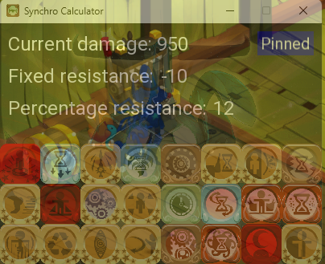

# Synchro Calculator Dofus 3

### A simple calculator used to find the current damage of the Xelor's Sychro in Dofus 3

## Features

- Keeps track of current telefrags done and the current damage of the Synchro.
- Can input flat and percent resistances of the target.
- Can be pinned to stay on top of other windows.
- Will become transparent when not in focus.

## Usage

Just run the .exe file to get the GUI.\
Click on the number to change to input new values for the resistances.\
Click on the spells to mark them as "Used" and to increase the damage of the Synchro.

## Screenshots

## Informations

Up to date with Dofus 3.0\
All images are Ankama Games property.
